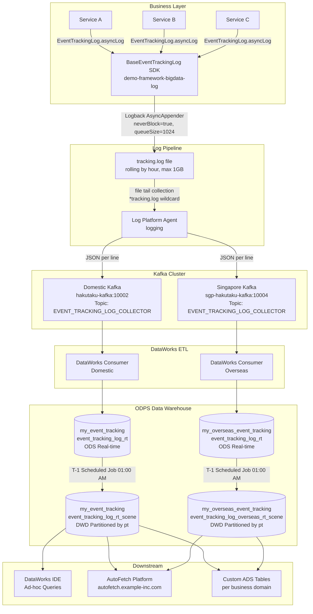
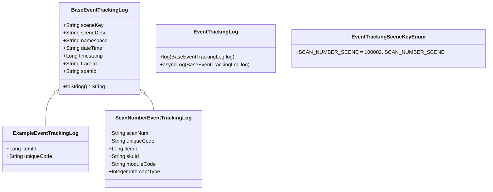

# Design Document: Server-Side Unified Event Tracking

> **《server-side event tracking / event logging》**

---

## 1. Background

### 1.1 Current Pain Points

The existing server-side tracking is inconsistent:

| Problem | Impact |
| :--- | :--- |
| Teams write directly to MySQL for data sync | High latency, non-real-time, heavy DB pressure |
| Manual Kafka message publishing in business code | Intrusive, error-prone, non-standardized |
| Custom log component modifications per team | Duplicated effort, no reuse |
| No unified SDK or standard | Inconsistent data formats, poor data quality |

### 1.2 Industry Reference

This design references the server-side event tracking architectures used by:
- **Alibaba** — unified log SDK + SLS + MaxCompute pipeline
- **DiDi** — unified event tracking + Kafka + Flink + Hive
- **ByteDance ** — unified SDK + log collection agent + data lake

---

## 2. Core Architecture

### 2.1 Design Principle

> **Unified SDK → Log Collection Layer → Kafka → Stream Processor → Data Warehouse → Downstream Consumers**

The key insight is separating concerns:
- **Business code** only calls `EventTrackingLog.asyncLog(log)` — zero knowledge of infrastructure
- **Log Platform** handles collection, routing, and Kafka delivery
- **DataWorks** handles warehouse ingestion and scheduling
- **ODPS** handles storage, partitioning, and query serving

### 2.2 Full Architecture Diagram



---

## 3. SDK Design

### 3.1 Dependency

```xml  
<!-- Maven Dependency -->
<dependency>
    <groupId>com.my.demo</groupId>
    <artifactId>demo-framework-bigdata-log</artifactId>
    <version>${bigdata-log.version}</version>
</dependency>  
```

Source: `https://github.com/Clairehou111/demo-framework`

### 3.2 SDK Class Hierarchy



### 3.3 Usage Example

```java  
// 1. Define your custom log class — only @Getter & @Setter
@Setter  
@Getter  
public class ScanNumberEventTrackingLog extends BaseEventTrackingLog {  
    private String scanNum;  
    private String uniqueCode;  
    private Long itemId;  
    private String skuId;  
    private String moduleCode;  
    private Integer interceptType;  
}  

// 2. Define scene keys using an Enum  
@Getter  
@AllArgsConstructor  
public enum EventTrackingSceneKeyEnum implements Serializable {  
    SCAN_NUMBER_SCENE("1000001", "SCAN_NUMBER");  

    private String sceneKey;  
    private String sceneDesc;  
}  

// 3. Collect and fire the tracking event  
ScanNumberEventTrackingLog bigDataLog = new ScanNumberEventTrackingLog();  
bigDataLog.setScanNum(request.getNumber());  
bigDataLog.setModuleCode(request.getModule());  
bigDataLog.setItemId(operateItem.getId());  
bigDataLog.setUniqueCode(operateItem.getUniqueCode());  
bigDataLog.setSkuId(operateItem.getSkuId());  

EventTrackingLog.asyncLog(bigDataLog);  // Non-blocking async fire-and-forget  
```


### 3.4 Output Log Format

```json  
{  
  "dateTime": "2025-08-23 13:03:01",  
  "traceId": "00000000000000000000000000000000",  
  "spanId": "abc123def456",  
  "data": {  
    "itemId": 242354211,  
    "uniqueCode": "P243232322423"  
  },  
  "sceneKey": "123456",  
  "namespace": "test",  
  "timestamp": 1692766981199  
}  
```

---

## 4. Log Collection Configuration

Configure Logback to write tracking logs into a dedicated rolling file. This file is picked up by the Log Platform agent.

```xml  
<!-- logback-spring.xml -->  
<configuration>  
    <property name="LOG_PATH"  
        value="${LOG_PATH:-${LOG_TEMP:-${java.io.tmpdir:-/tmp}}}"/>  
    <springProperty scope="context" name="APP_NAME"  
        source="avatar.application.app" defaultValue="avatar"/>  

    <!-- Event Tracking Log File Appender -->  
    <appender name="trackingLogAppender"  
        class="ch.qos.logback.core.rolling.RollingFileAppender">  
        <encoder>  
            <pattern>%msg%n</pattern>  <!-- Pure JSON per line, no prefix -->  
        </encoder>  
        <file>${LOG_PATH}/${APP_NAME}-tracking.log</file>  
        <rollingPolicy  
            class="ch.qos.logback.core.rolling.SizeAndTimeBasedRollingPolicy">  
            <FileNamePattern>  
                ${LOG_PATH}/${APP_NAME}-bigdata.%d{yyyy-MM-dd-HH}.%i.log  
            </FileNamePattern>  
            <MaxHistory>48</MaxHistory>      <!-- Keep 48 hours of rolling logs -->  
            <maxFileSize>1GB</maxFileSize>  
            <totalSizeCap>20GB</totalSizeCap>  
        </rollingPolicy>  
    </appender>  

    <!-- Async Wrapper — prevents tracking from blocking business threads -->  
    <appender name="trackingAsyncLogAppender"  
        class="ch.qos.logback.classic.AsyncAppender"  
        additivity="false">  
        <discardingThreshold>0</discardingThreshold>  <!-- Never discard -->  
        <queueSize>1024</queueSize>  
        <neverBlock>true</neverBlock>                 <!-- Non-blocking offer() -->  
        <appender-ref ref="trackingLogAppender"/>  
    </appender>  

</configuration>  
```

---

## 5. Dynamic Log Switches

Control tracking globally or per-scene without redeployment:

```properties  
# Global switch — default: true (enabled)  
bigdataLog.active=true  

# Canary/gray release switch — default: false  
gray.bigdataLog.active=true  

# Per-scene switch (replace {sceneKey} with actual key)  
bigdataLog.active.{sceneKey}=true  
```

---

## 6. Kafka Clusters

| Environment | Cluster | Bootstrap Server                       | Topic |
| :--- | :--- |:---------------------------------------| :--- |
| **T1 (Test)** | — | `t1-k8s-kafka.example-inc.net:30701`   | — |
| **Pre-release** | — | `pre-kafka.example-inc.com:30802`      | — |
| **Production (Domestic)** | hakutaku-kafka | `hakutaku-kafka.example-inc.com:10002` | `EVENT_TRACKING_LOG_COLLECTOR` |
| **Production (Singapore)** | sgp-hakutaku-kafka | `sgp-hakutaku-kafka.example.com:10004` | `EVENT_TRACKING_LOG_COLLECTOR` |
| **Production (DWD)** | — | `rt-bigdata-dwd.example-inc.com:10021` | — |

> ⚠️ `EVENT_TRACKING_LOG_COLLECTOR` is exclusively for tracking log events. Do **not** send unrelated messages to this topic.

---

## 7. Data Warehouse Tables

### 7.1 ODS Real-Time Table

| Property | Value                                           |
| :--- |:------------------------------------------------|
| **Domestic** | `my_event_tracking.event_tracking_log_rt`          |
| **Overseas** | `my_overseas_event_tracking.event_tracking_log_rt` |
| **Partition** | `year` / `month` / `day` / `hour`               |
| **Lifecycle** | Permanent (永久存储)                                |
| **Engine** | MaxCompute (ODPS)                               |
| **Created** | 2024-01-01                                      |

**Query Example (ODS):**

```sql  
SELECT  
     GET_JSON_OBJECT(message, '$.namespace')  AS namespace  
    ,GET_JSON_OBJECT(message, '$.sceneKey')   AS sceneKey  
    ,GET_JSON_OBJECT(message, '$.sceneDesc')  AS sceneDesc  
    ,GET_JSON_OBJECT(message, '$.dateTime')   AS dateTime  
    ,GET_JSON_OBJECT(message, '$.timestamp')  AS timestamp  
    ,GET_JSON_OBJECT(message, '$.traceId')    AS traceId  
    ,GET_JSON_OBJECT(message, '$.spanId')     AS spanId  
    ,GET_JSON_OBJECT(message, '$.data')       AS data  
    ,year, month, day, hour  
FROM my_event_tracking.event_tracking_log_rt  
WHERE year  = '2023'  
  AND month = '09'  
  AND day   = '19'  
  AND hour  = '10'  
LIMIT 1000;  
```

### 7.2 DWD T-1 Scene Table (Recommended)

| Property | Value |
| :--- | :--- |
| **Domestic** | `my_event_tracking.event_tracking_log_rt_scene` |
| **Overseas** | `my_overseas_event_tracking.event_tracking_log_overseas_rt_scene` |
| **Partition** | `pt` (YYYYMMDD) |
| **Refresh** | Daily T-1 at 01:00 AM via DataWorks |
| **Use Case** | All analytical queries — significantly faster than ODS |

**Query Example (T-1 Scene Table):**

```sql  
-- Domestic  
SELECT *  
FROM my_event_tracking.event_tracking_log_rt_scene  
WHERE sceneKey   = '1000020'  
  AND namespace  = 'event-tracking-pipeline_xx-service'  
  AND pt         = '20241201'  
LIMIT 100;  

-- Overseas  
SELECT *  
FROM my_overseas_event_tracking.event_tracking_log_overseas_rt_scene  
WHERE sceneKey   = '1000020'  
  AND namespace  = 'event-tracking-pipeline_xx-service'  
  AND pt         = '20241201'  
LIMIT 100;  
```

---

## 8. Onboarding Guide

### Step 1 — Add SDK Dependency
Add `demo-framework-bigdata-log` to your `pom.xml` (see Section 3.1).

### Step 2 — Configure Logback
Add the `trackingLogAppender` and `trackingAsyncLogAppender` blocks to your `logback-spring.xml` (see Section 4).

### Step 3 — Define Scene Keys
Create a `EventTrackingSceneKeyEnum` in your service defining your `sceneKey` and `sceneDesc` values.

### Step 4 — Implement Log Classes
Create classes extending `BaseEventTrackingLog` with `@Getter` and `@Setter` only.

### Step 5 — config logfile and kafka topic in dataworks

| Environment | Action Required |
| :--- | :--- |
| **Test / Pre-release** | Submit log collection ticket only — no Kafka publishing needed |
| **Production** | Submit log collection ticket + request Kafka cluster + topic assignment |

Work order details to include:
- Log directory: `/logs`
- Log filename pattern: `*tracking.log`
- Log format: `json`
- Purpose: Event Tracking log collection, forward to Kafka for DataWorks consumption

### Step 6 — Verify Data
After production deployment, verify data in the ODPS console:
`https://cn-hangzhou.data.aliyun.com/?defaultProjectId=33233#/main`
