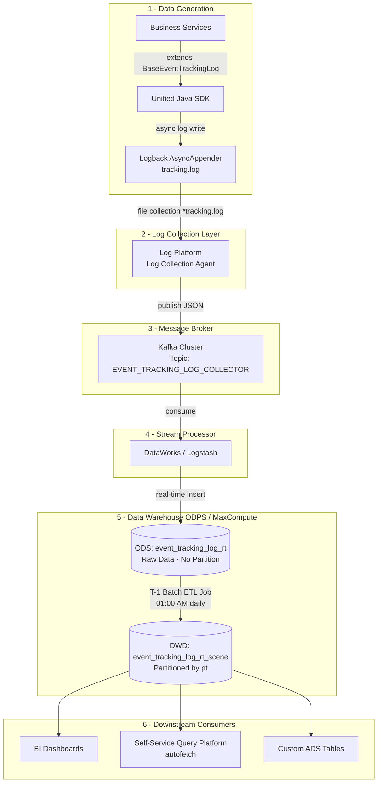

# Server-Side Unified Event Tracking Pipeline

> Based on the internal design document: `DESIGN.md`

---

## 📋 Background & Problem Statement

Previously, server-side tracking capability was fragmented across teams. Business services relied on multiple inconsistent approaches:

- Writing directly to **MySQL** and syncing to the data warehouse
- Manually publishing messages to **Kafka** for log collection
- Modifying logging components to manually write Kafka messages

This resulted in:
- ❌ Duplicated capability across teams
- ❌ Intrusive tracking code polluting business logic
- ❌ No unified standard or governance
- ❌ Low data sensitivity among developers

**Goal:** Build a unified server-side tracking pipeline that lowers the barrier to event tracking integration, increases developer data awareness, and provides better data support for business, product, developers, and data analysts.

---

## 🏗 High-Level Design

This architecture follows a well-established industry pattern used by Alibaba, DiDi, and ByteDance. The core principle:

> **Unified SDK → Log Collection Layer → Kafka → Stream Processor → Data Warehouse → Downstream Consumers**

By decoupling data generation from data processing, the architecture ensures high availability, scalability, and clean data governance across the entire supply chain domain.



---

## 🔄 Component Mapping: Production vs. Local Simulation

| Logical Layer | Production (Alibaba Cloud) | Local Simulation (Docker) | Purpose |
| :--- | :--- | :--- | :--- |
| **Data Source** | Production Java Applications | Java SDK Mock | Generates standardized JSON tracking logs |
| **Log Appender** | Logback AsyncAppender | Logback AsyncAppender | Async write to `*tracking.log` file |
| **Log Collection** | Log Platform (fusion-logging) | Logstash File Input | Tails and collects `*tracking.log` |
| **Message Queue** | Kafka (hakutaku-kafka cluster) | Kafka / HTTP Input | Buffers high-throughput real-time streams |
| **Stream Processor** | DataWorks DI | Logstash | Parses JSON, standardizes timestamps, routes data |
| **Data Warehouse** | MaxCompute (ODPS) | ClickHouse | High-performance columnar analytics database |
| **ODS Layer** | `event_tracking_log_rt` | `event_tracking_log_rt` | Raw unpartitioned continuous streaming data |
| **DWD Layer** | `event_tracking_log_rt_scene` | `event_tracking_log_rt_scene` | Cleaned data partitioned by day (`pt`) |
| **ETL Scheduler** | DataWorks Scheduler | Cron / Manual SQL | Triggers daily T-1 extraction at 01:00 AM |
| **Query Platform** | DataWorks IDE / AutoFetch | ClickHouse Play UI | Ad-hoc queries and data exploration |

---

## 📐 Tracking Log Specification (SDK Standard)

All tracking events must follow the unified JSON schema. The `BaseEventTrackingLog` class enforces this automatically.

```json  
{  
  "timestamp": 1692766981199,  
  "dateTime": "2023-08-21 18:28:20",  
  "traceId": "0aee5cc564e0803a68af93a609824075",  
  "spanId": "abc123",  
  "namespace": "event-tracking-pipeline_xx-service",  
  "sceneKey": "200100",  
  "sceneDesc": "Business scene description",  
  "data": {  
    "unique_code": "xxxxxx",   
    "spu_id": "xxxxx",  
    "sku_id": "xxxxx",  
    "biz_type": "xxxx",  
    "category_id": "xxxx",  
    "operate_repository": "xxx",  
    "operate_user_id": "xxxx",  
    "operate_user_name": "xxxx"  
  }  
}  
```

| Field | Type | Description |
| :--- | :--- | :--- |
| `timestamp` | `Long` | Epoch milliseconds |
| `dateTime` | `String` | Human-readable datetime `yyyy-MM-dd HH:mm:ss` |
| `traceId` | `String` | Distributed trace ID for cross-service correlation |
| `spanId` | `String` | Span ID within the trace |
| `namespace` | `String` | Application / service name (e.g., `mes`, `pink-interfaces`) |
| `sceneKey` | `String` | Business-defined scene code (e.g., `100002`) |
| `sceneDesc` | `String` | Human-readable scene description |
| `data` | `Object` | Custom business payload — flexible per scene |

---

## 🗄 Table Schemas (Data Warehouse)

### ODS Layer — Real-Time Table (`_rt`)

Acts as the raw landing zone. Receives the continuous data stream 24/7. **No `pt` partition field**, as data arrives continuously.

> Production table: `my_event_tracking.event_tracking_log_rt`
> Overseas table: `my_overseas_event_tracking.event_tracking_log_rt`

```sql  
CREATE DATABASE IF NOT EXISTS my_event_tracking;  

CREATE TABLE IF NOT EXISTS my_event_tracking.event_tracking_log_rt (  
    namespace  String,  
    sceneKey   String,  
    sceneDesc  String,  
    dateTime   String,     -- 'yyyy-MM-dd HH:mm:ss'  
    timestamp  Int64,      -- epoch milliseconds  
    traceId    String,  
    spanId     String,  
    data       String,     -- raw JSON string payload  
    message    String,     -- full raw log line  
    year       String,  
    month      String,  
    day        String,  
    hour       String  
) ENGINE = MergeTree()  
ORDER BY (namespace, dateTime);  
```

### DWD Layer — T-1 Offline Scene Table (`_scene`)

Structured Data Warehouse Detail layer. Introduces the **`pt` (Partition Time)** field following standard ODPS partition design. Recommended for all analytical queries due to significantly faster performance.

> Production table (domestic): `my_event_tracking.event_tracking_log_rt_scene`
> Production table (overseas): `my_overseas_event_tracking.event_tracking_log_overseas_rt_scene`

```sql  
CREATE TABLE IF NOT EXISTS my_event_tracking.event_tracking_log_rt_scene (  
    pt         String,     -- partition date e.g. '20260324'  
    namespace  String,  
    sceneKey   String,  
    sceneDesc  String,  
    dateTime   String,  
    timestamp  Int64,  
    traceId    String,  
    spanId     String,  
    data       String  
)  
ENGINE = MergeTree()  
PARTITION BY pt  
ORDER BY (namespace, sceneKey);  
```

---

## ⚙️ ETL Process: The T-1 Batch Job

In production, a DataWorks node executes nightly at 01:00 AM. It reads exactly **yesterday's (T-1)** data from the `_rt` table, generates the `pt` partition field, and inserts it into the `_scene` table.

**Local simulation SQL:**

```sql  
INSERT INTO my_event_tracking.event_tracking_log_rt_scene  
SELECT  
    -- Dynamically generate 'pt' from dateTime (e.g., '20260324')  
    formatDateTime(parseDateTimeBestEffort(dateTime), '%Y%m%d') AS pt,  
    namespace,  
    sceneKey,  
    sceneDesc,  
    dateTime,  
    timestamp,  
    traceId,  
    spanId,  
    data  
FROM my_event_tracking.event_tracking_log_rt  
-- T-1 Filter: only yesterday's data  
WHERE toDate(parseDateTimeBestEffort(dateTime)) = yesterday();  
```

---

## 🚀 Quick Start (Local Simulation)

### 1. Start the Infrastructure

```bash  
docker compose up -d  
```

### 2. Initialize ClickHouse Tables

Connect to ClickHouse Web UI at `http://localhost:8123/play` and execute both schema creation scripts above for `_rt` and `_scene`.

### 3. Generate T-1 Mock Data (Java SDK)

To test the ETL job, backdate your mock logs to yesterday:

```java  
import java.time.LocalDateTime;  
import java.time.format.DateTimeFormatter;  
import java.time.ZoneId;  

// Generate T-1 datetime  
LocalDateTime yesterday = LocalDateTime.now().minusDays(1);  
DateTimeFormatter formatter = DateTimeFormatter.ofPattern("yyyy-MM-dd HH:mm:ss");  
String yesterdayStr = yesterday.format(formatter);  
long yesterdayTimestamp = yesterday.atZone(ZoneId.systemDefault()).toInstant().toEpochMilli();  

// Inject into log object  
this.setDateTime(yesterdayStr);  
this.setTimestamp(yesterdayTimestamp);  
```

### 4. Verify Real-Time Ingestion

```sql  
SELECT count(*) FROM my_event_tracking.event_tracking_log_rt;  
```

### 5. Run the T-1 ETL Job

Execute the `INSERT INTO ... SELECT` query from the ETL section above.

### 6. Verify Partitioned Output

```sql  
SELECT *  
FROM my_event_tracking.event_tracking_log_rt_scene  
WHERE pt = formatDateTime(yesterday(), '%Y%m%d');  
```

### Useful Commands

| Command | Description |
| :--- | :--- |
| `docker compose up -d` | Start all containers |
| `docker compose logs -f logstash` | Tail Logstash ingestion logs |
| `docker exec -it clickhouse clickhouse-client` | Open ClickHouse CLI |
| `docker compose down` | Stop all containers |
